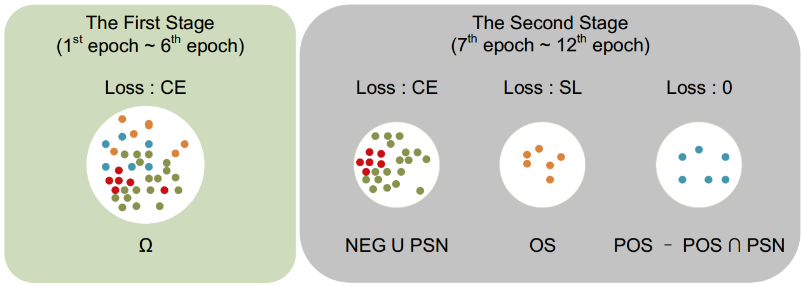

# Learning-with-Noisy-Class-Labels-for-Instance-Segmentation
The project about 'Learning with Noisy Class Labels for Instance Segmentation'.

## 1. Introducton

Instance segmentation has achieved siginificant progress in the presence of correctly annotated datasets. Yet, object classes in largescale datasets are sometimes ambiguous, which easily causes confusion. In addition, limited experience and knowledge of annotators can also lead to mislabeled object classes. To solve this issue, a novel method is proposed in this paper, which uses different losses describing different roles of noisy class labels to enhance the learning. Specifically, in instance segmentation, noisy class labels play different roles in the foregroundbackground sub-task and the foreground-instance sub-task. Hence, on the one hand, the noise-robust loss (e.g., symmetric loss) is used to prevent incorrect gradient guidance for the foreground-instance sub-task. On the other hand, standard cross entropy loss is used to fully exploit correct gradient guidance for the foreground-background sub-task. Extensive experiments conducted with three popular datasets (i.e., Pascal VOC, Cityscapes and COCO) have demonstrated the effectiveness of our method in a wide range of noisy class labels scenarios.

The project is mainly based on mmdetection v2.2.0. More details will be released! Main results in the paper are based on older mmdetection (v1.0rc0).

## 2. Main Results

On Cityscapes dataset:

On COCO dataset:

## 3. Usage
### 3.1. Installtion

Please check [install.md](docs/install.md) for installation instructions.

### 3.2. Data Generation

Files [noisy_labels_AN_Cityscapes.py](/noisy_labels_AN_Cityscapes.py) and [noisy_labels_SN_Cityscapes.py](/noisy_labels_SN_Cityscapes.py) can be used to generate class labels with asymmetric noise and symmetric noise for Cityscapes dataset, respectively. The noise rate and the annotation file path need be set manually in these files. 

### 3.3. Stage-wise Training

On Cityscapes dataset, models should be firstly trained with the config [mask_rcnn_r50_fpn_1x_cityscapes_nl_1.py](/configs/cityscapes/mask_rcnn_r50_fpn_1x_cityscapes_nl_1.py) in early stages of training. Then, in mature stages of training, the config [mask_rcnn_r50_fpn_1x_cityscapes_nl_2.py](/configs/cityscapes/mask_rcnn_r50_fpn_1x_cityscapes_nl_2.py) is used to train models.

### 3.4. Evaluation

## 4. Designed Loss

Our designed loss is provided in [new_combination_loss.py](/mmdet/models/losses/new_combination_loss.py). Symmetric cross entropy loss and generalized cross entropy loss are also provided in [symmetric_cross_entropy_loss.py](/mmdet/models/losses/symmetric_cross_entropy_loss.py) and [generalized_cross_entropy_loss.py](/mmdet/models/losses/generalized_cross_entropy_loss.py), respectively.
